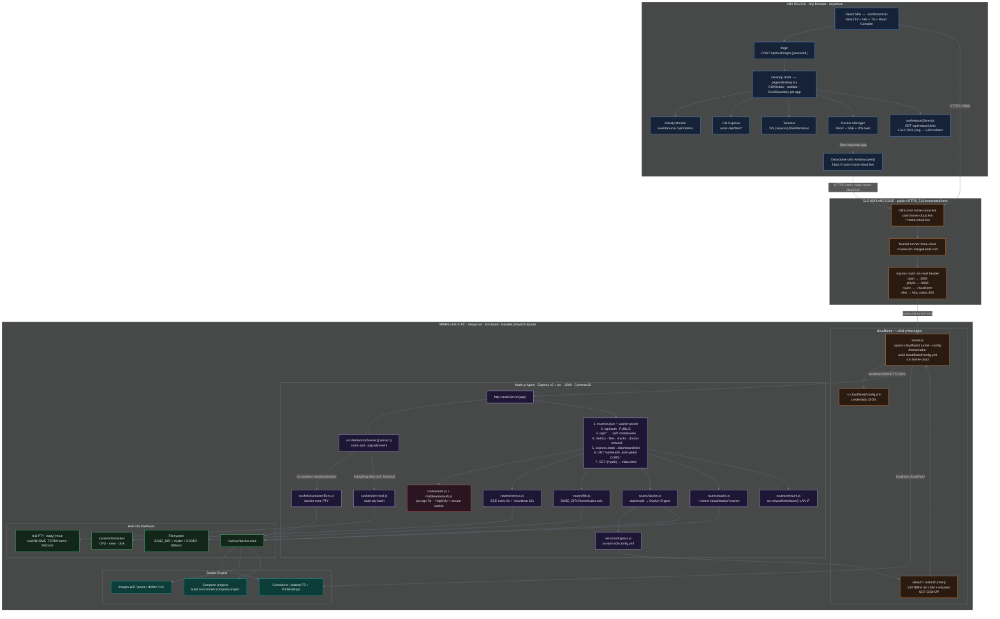
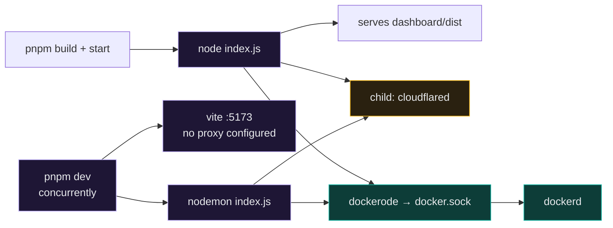
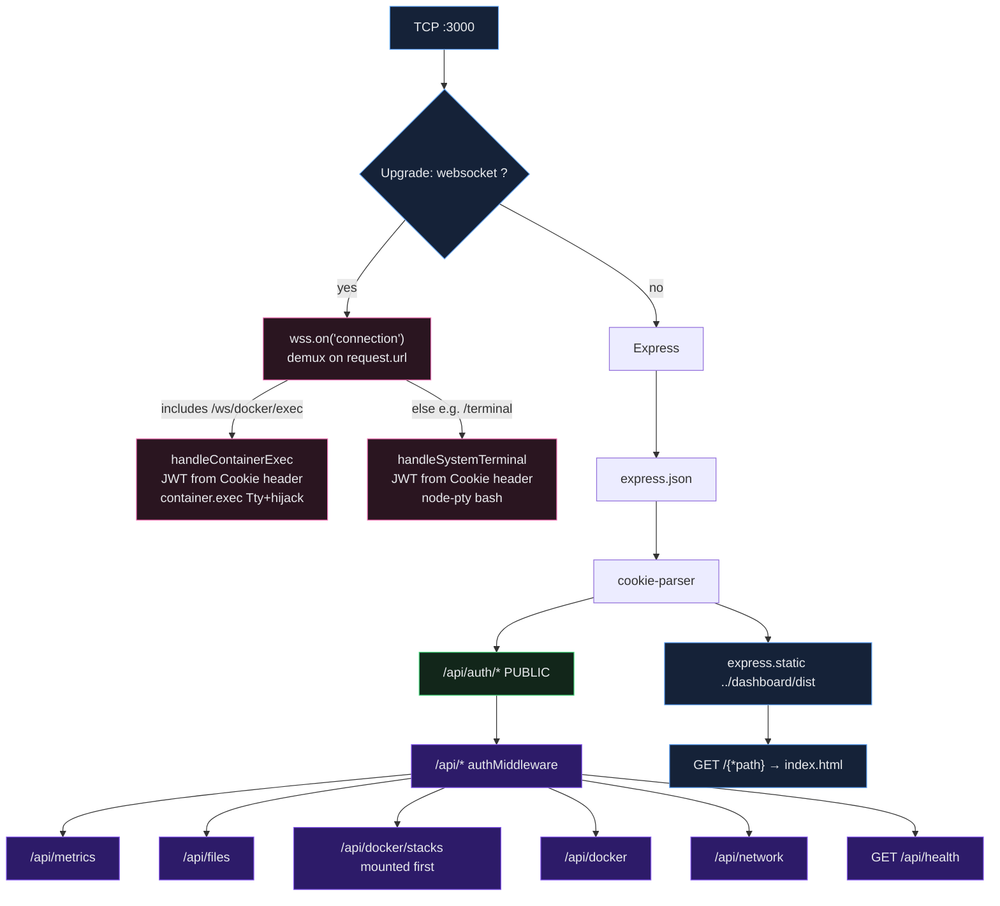
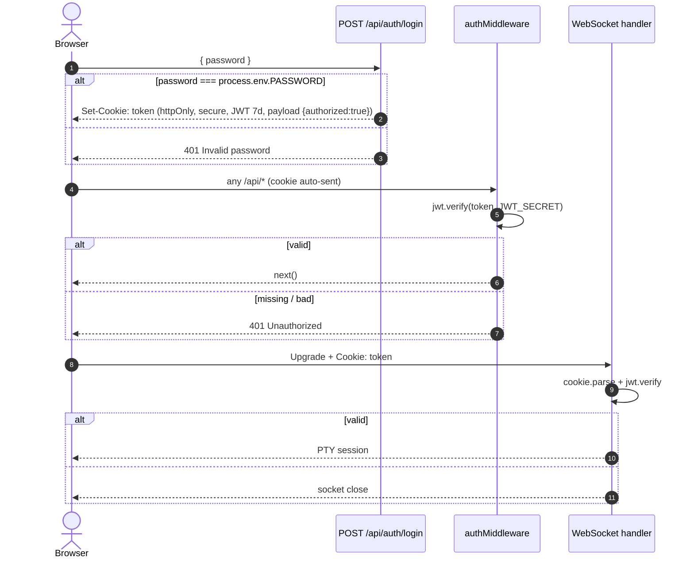
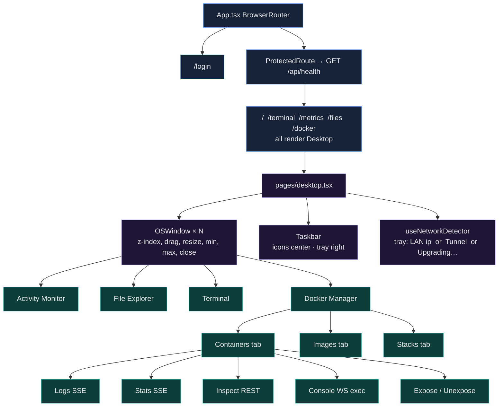
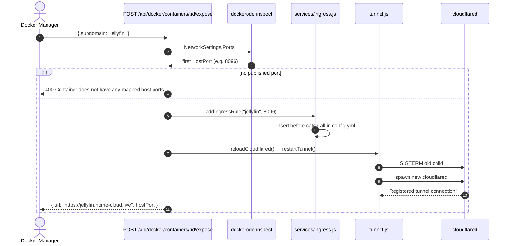
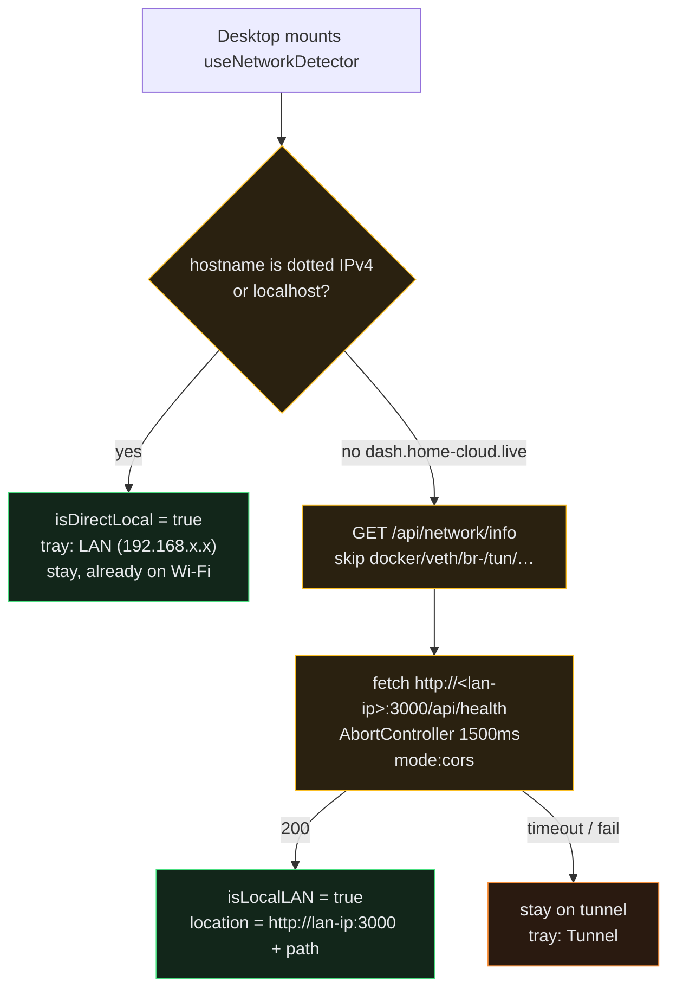

# Home Cloud — System Design

This is the as-built architecture of the running system. Every box, port, and path below maps to code in `agent/` or `dashboard/`. Roadmap items that are **not** shipped (App Store, noVNC, Cloudflare DNS API, SIGHUP reload) are called out separately and do not appear as live components.

---

## 1. What the system is

Home Cloud turns a spare Linux PC into a remotely managed server. The spare PC sits behind home NAT / CGNAT (typical of Indian ISPs). It cannot accept inbound connections, so it opens one **outbound** Cloudflare Tunnel. A browser anywhere then reaches a Web-OS control plane over HTTPS, and optionally reaches installed Docker apps on their own subdomains.

```
Control plane  =  dash.home-cloud.live   →  Agent :3000  (dashboard + API + WebSocket)
Data plane     =  <app>.home-cloud.live  →  container host port  (the app's own UI)
```

Those two planes are different browser origins on purpose. Installed apps open in new tabs via `window.open()`, never in an iframe (`X-Frame-Options` would block them).

---

## 2. Whole-system architecture

Read this top-to-bottom. Traffic always originates from a browser. The home router never opens an inbound port.



### Physical path of a request

```
┌──────────────┐   HTTPS / WSS    ┌─────────────────────┐   outbound QUIC/HTTP2    ┌──────────────────────────┐
│   Browser    │ ───────────────► │  Cloudflare Edge    │ ◄────────────────────── │  cloudflared on spare PC │
│  any device  │ ◄─────────────── │  TLS + Host route   │                         │  child of Agent          │
└──────────────┘                  └──────────┬──────────┘                         └────────────┬─────────────┘
                                             │ Host: dash.home-cloud.live                      │
                                             │ Host: jellyfin.home-cloud.live                  ▼
                                             │                                                 ┌──────────────────────────┐
                                             │                                    localhost:3000│  Agent  Express + ws     │
                                             │                                    localhost:8096│  Docker published ports  │
                                             └────────────────────────────────────────────────►└──────────────────────────┘
```

CGNAT means the right-hand side can only *leave* the house. Cloudflare flips the direction: the PC dials out, then Cloudflare relays the browser in.

---

## 3. Repo and process layout

pnpm workspace. Two packages. No extra runtime.

```
home_cloud/
├── package.json                 concurrently: agent + dashboard
├── pnpm-workspace.yaml          agent, dashboard
│
├── agent/                       CommonJS  —  no "type": "module"
│   ├── index.js                 HTTP + WS server, route mount order, startTunnel()
│   ├── tunnel.js                spawn / kill / respawn cloudflared
│   ├── middleware/auth.js       jwt.verify(req.cookies.token)
│   ├── services/ingress.js      read/write ~/.cloudflared/config.yml
│   ├── routes/
│   │   ├── auth.js              POST /login  POST /logout
│   │   ├── metrics.js           GET /           SSE
│   │   ├── file.js              CRUD + search + drives
│   │   ├── docker.js            containers, images, expose
│   │   ├── stacks.js            compose deploy / start / stop / logs
│   │   └── network.js           GET /info  LAN IP
│   └── sockets/
│       ├── terminal.js          host bash via node-pty
│       └── containerExec.js     docker exec bash-or-sh
│
└── dashboard/                   ESM  —  React 19 + Vite 8 + TS
    └── src/
        ├── App.tsx              BrowserRouter routes
        ├── hooks/useNetworkDetector.ts
        ├── components/
        │   ├── ProtectedRoute.tsx     GET /api/health
        │   ├── OSWindow.tsx           drag / resize / min / max / close
        │   └── apps/
        │       ├── SystemMonitorApp.tsx
        │       ├── TerminalApp.tsx
        │       ├── DockerApp.tsx
        │       └── ContainerConsoleTab.tsx
        └── pages/
            ├── login.tsx
            ├── desktop.tsx            Web-OS shell + taskbar
            └── files.tsx              File Explorer window body
```

### Runtime topology



Production is one Node process on `:3000` that serves the built SPA, the API, and both WebSocket kinds. Dev runs Vite separately; there is no `server.proxy` in `vite.config.ts`, so the intended remote/LAN path is always through the Agent.

---

## 4. Agent internals

### 4.1 Single-port HTTP + WebSocket

`agent/index.js` creates one `http.Server`, then hangs `ws.WebSocketServer({ server })` on it. Cloudflare therefore only needs one ingress target for the control plane: `http://localhost:3000`.



Mount order is load-bearing:

| Order | Mount | Why it is there |
|------:|-------|-----------------|
| 1 | `express.json` + `cookie-parser` | Body + `req.cookies.token` |
| 2 | `/api/auth` | Login/logout must work without a cookie |
| 3 | `/api` + `authMiddleware` | Everything else under `/api` needs JWT |
| 4 | `/api/docker/stacks` **before** `/api/docker` | Otherwise `:id` on docker would swallow `stacks` |
| 5 | `/api/docker`, `/api/files`, `/api/metrics`, `/api/network` | Feature routers |
| 6 | `express.static(dashboard/dist)` | Built SPA assets |
| 7 | `GET /api/health` | Auth-gated liveness; `ProtectedRoute` and LAN probe |
| 8 | `GET /{*path}` → `index.html` | React Router deep links (`/docker`, `/files`, …) |

### 4.2 Auth

Single shared passcode. One JWT. No users table.



`httpOnly` keeps the token out of JS (XSS). `secure` means it only rides HTTPS — correct on the tunnel, awkward on raw `http://192.168.x.x:3000` unless the browser already has a cookie from a previous HTTPS session or `secure` is flipped for LAN.

`ProtectedRoute` does **not** read the cookie. It `GET /api/health`. 200 means the middleware accepted the cookie; 401 sends the user to `/login`.

### 4.3 API surface

**Auth** (`routes/auth.js`)

| Method | Path | Notes |
|--------|------|-------|
| POST | `/api/auth/login` | Sets cookie |
| POST | `/api/auth/logout` | `clearCookie('token')` |

**Health / network**

| Method | Path | Notes |
|--------|------|-------|
| GET | `/api/health` | `{status:"ok"}`, CORS `*`, still behind JWT middleware |
| GET | `/api/network/info` | First non-virtual IPv4 + port `3000` |

**Metrics** (`routes/metrics.js`)

| Method | Path | Notes |
|--------|------|-------|
| GET | `/api/metrics` | SSE. `retry: 5000`. Body every 2s from `systeminformation` (`currentLoad`, `mem`, `fsSize`). Comment `: heartbeat` every 15s so Cloudflare does not idle-kill the stream. |

**Files** (`routes/file.js`) — sandbox `BASE_DIR = /home/rudra-unix`

| Method | Path | Notes |
|--------|------|-------|
| GET | `/api/files` | List directory |
| GET | `/api/files/download` | Stream file |
| GET | `/api/files/view` | Inline preview (`mime-types`) |
| GET | `/api/files/drives` | `systeminformation` mounts |
| GET | `/api/files/search` | `child_process.spawn` |
| POST | `/api/files/upload` | `multer` to resolved dest |
| POST | `/api/files/copy` | |
| POST | `/api/files/folder` | mkdir |
| POST | `/api/files/file` | touch |
| PATCH | `/api/files/rename` | |
| PATCH | `/api/files/move` | `rename`, or `cp`+`rm` on `EXDEV` |
| DELETE | `/api/files/delete` | |

Guard is `path.resolve` then `startsWith(BASE_DIR)` (no trailing-slash variant).

**Docker containers / images** (`routes/docker.js`) — `dockerode` default socket

| Method | Path | Notes |
|--------|------|-------|
| GET | `/api/docker/containers` | `listContainers({all:true})` + `exposedRule` from ingress YAML |
| POST | `/api/docker/containers/create` | image, name, env, ports, volumes, restartPolicy; then start |
| POST | `/api/docker/containers/:id/start` | 304 → 409 already running |
| POST | `/api/docker/containers/:id/stop` | stop + `removeIngressByPort` + reload |
| POST | `/api/docker/containers/:id/restart` | |
| DELETE | `/api/docker/containers/:id/delete` | remove + ingress cleanup; 409 if still running |
| GET | `/api/docker/containers/:id/stats` | SSE `container.stats({stream:true})` |
| GET | `/api/docker/containers/:id/inspect` | full inspect JSON |
| GET | `/api/docker/containers/:id/logs` | SSE follow, tail 200, timestamps, TTY demux |
| GET | `/api/docker/containers/:id/logs/download` | attachment |
| POST | `/api/docker/containers/:id/expose` | `{subdomain}` → first HostPort → YAML → restart tunnel |
| POST | `/api/docker/containers/:id/unexpose` | `{subdomain}` → drop rule → restart |
| GET | `/api/docker/images` | |
| GET | `/api/docker/images/pull?image=` | SSE layer progress |
| DELETE | `/api/docker/images/:id` | 409 if in use |
| POST | `/api/docker/images/prune` | |

**Stacks** (`routes/stacks.js`) — disk + compose CLI + `dockerode-compose`

| Method | Path | Notes |
|--------|------|-------|
| GET | `/api/docker/stacks` | folders in `~/.home-cloud/stacks` ∪ compose-project labels |
| GET | `/api/docker/stacks/:name` | YAML + member containers |
| POST | `/api/docker/stacks/deploy` | write YAML, `docker compose -p <name> up -d --remove-orphans`, SSE lines |
| POST | `/api/docker/stacks/:name/start` | `dockerode-compose.up()` or `docker compose start` |
| POST | `/api/docker/stacks/:name/stop` | `compose.down()` or `docker compose stop` |
| DELETE | `/api/docker/stacks/:name` | `down({volumes:true})` + `rm -rf` stack dir |
| GET | `/api/docker/stacks/:name/logs` | SSE `docker compose logs -f --tail=200` |

---

## 5. Dashboard internals

The dashboard is a single-page Web OS, not a multi-page admin site.



Deep links (`/docker`, `/files`, …) only decide which `OSWindow` opens. The shell is always `Desktop`. Each window is wrapped in an `ErrorBoundary` so one crash does not blank the desktop.

Transport choices on the client:

| Surface | Transport | Why |
|---------|-----------|-----|
| Login / files / docker actions | `fetch` / `axios` (cookies included, same origin) | Request/response |
| Metrics, container stats/logs, image pull, stack deploy/logs | `EventSource` | Server → client stream, auto-retry |
| Host terminal | `WebSocket` `//${host}/terminal` | Bidirectional bytes |
| Container console | `WebSocket` `//${host}/ws/docker/exec?containerId=` | Bidirectional + JSON `{type:"resize"}` |

---

## 6. Critical data flows

### 6.1 Host terminal

```
xterm.js keystroke
    → WebSocket  /terminal
    → sockets/terminal.js  jwt.verify
    → node-pty.write → bash
    → PTY onData → ws.send
    → xterm.write
```

A real PTY is mandatory. `child_process.spawn` makes `isatty()` false; vim, htop, and fzf then misbehave.

There is no client reconnect. A dropped tunnel requires reopening the window.

### 6.2 Metrics

```
systeminformation every 2s
    → res.write("data: "+JSON+"\n\n")
    → EventSource.onmessage
    → MeterBar + 60-point SparklineChart

every 15s: res.write(": heartbeat\n\n")
    → EventSource ignores  (SSE comment)
    → Cloudflare idle timer resets
```

SSE over long-poll HTTP because: proxies buffer ordinary responses, Cloudflare kills idle HTTP, and SSE already has framing + `retry:`.

### 6.3 Expose a container (control plane → data plane)

This is the glue between Docker and Cloudflare. There is **no** Cloudflare DNS API call in the running agent. The code writes YAML and restarts `cloudflared`. DNS for `*.home-cloud.live` is assumed to already point at the tunnel.



Stop and delete walk the published ports the other way: `removeIngressByPort(hostPort)` then the same restart.

Ingress file shape the agent actually edits:

```yaml
tunnel: <uuid>
credentials-file: /home/rudra-unix/.cloudflared/<uuid>.json
ingress:
  - hostname: dash.home-cloud.live
    service: http://localhost:3000
  - hostname: jellyfin.home-cloud.live    # inserted by addIngressRule
    service: http://localhost:8096
  - service: http_status:404              # MUST stay last
```

`getIngressRules()` skips `dash.${CF_DOMAIN}` so the dashboard hostname is never treated as an "exposed app".

### 6.4 Stack deploy

```
POST /api/docker/stacks/deploy { name, yaml }
    → mkdir ~/.home-cloud/stacks/<name>/
    → write docker-compose.yml
    → spawn: docker compose -f … -p <name> up -d --remove-orphans
    → each stdout/stderr chunk  →  SSE  data: {"text":"…"}
    → close: data: {"status":"success"|"failed","exitCode":N}
```

List state is derived, not stored: compose project label `com.docker.compose.project` plus whatever folders exist on disk → `running` / `partial` / `stopped` / `uncreated`.

### 6.5 LAN vs tunnel (client-side, not DNS)

V3 split-horizon DNS is not shipped. What is shipped is a **page-origin redirect**.



When the redirect succeeds, the browser talks to the Agent at gigabit LAN RTT and never hairpins through Cloudflare. When it fails (phone on 4G, or LAN IP unreachable), the Cloudflare path is unchanged.

---

## 7. Trust boundaries and isolation

```
Internet
   │  TLS at Cloudflare  ·  no open router ports
   ▼
Cloudflare Edge
   │  Host-based ingress  ·  dash vs app hostnames
   ▼
cloudflared  (unprivileged child, outbound only)
   │  localhost only
   ▼
Agent :3000
   │  JWT cookie on /api/* and both WS handlers
   │  file sandbox BASE_DIR
   │  docker group → docker.sock   ←  this is root-equivalent
   ▼
Docker Engine
   │  per-container FS, PortBindings, compose project labels
   ▼
App containers   (data plane, own origin)
```

Implications:

- Anyone with the passcode has a host shell (`node-pty` as the Agent's user) and Docker (effectively host root). This is intentional for a single-owner spare PC.
- File routes cannot leave `/home/rudra-unix` by design, but the terminal can.
- Each exposed app is a separate origin (`jellyfin.home-cloud.live` vs `dash.home-cloud.live`), so cookies and storage do not leak across apps.
- Restarting the tunnel to apply ingress drops in-flight SSE/WS on `dash` for a moment. That is the current reload strategy.

---

## 8. Key decisions (as built)

| Decision | Rationale |
|----------|-----------|
| Cloudflare Tunnel, not a VPS or port-forward | CGNAT. The PC can only dial out. |
| One `cloudflared`, many hostnames | One process, one config, Host-header routing. |
| Docker for apps, Cloudflare for reachability | Lifecycle ≠ ingress. Agent orchestrates both. |
| Apps in new tabs, never iframe | Cross-origin `X-Frame-Options`. Control plane vs data plane. |
| Single port 3000 for HTTP + WS | One ingress target. `ws` hijacks `upgrade`. |
| SSE for metrics/logs/pull/deploy, WS for shells | One-way stream vs bidirectional PTY. |
| JWT in `httpOnly; secure` cookie | Auto-sent on XHR and WS handshake. Not readable by JS. |
| CommonJS agent | `node-pty` / `dockerode` native `.node` bindings want `require()`. |
| `restartTunnel()` instead of SIGHUP | What `services/ingress.js` actually calls today. |
| No Cloudflare DNS API in the agent | Expose only mutates local YAML. Wildcard/CNAME is out-of-band. |
| Client LAN probe + redirect, not split-horizon DNS | Works without a local DNS server. 1.5s fail-open to tunnel. |
| pnpm workspaces + concurrently | Two packages. No Turborepo. |
| Custom Docker UI, not Portainer iframe | Same origin, same auth, same windowing shell. |

---

## 9. What is not in this diagram

These exist in `docs/implementation/` as future work, not as running processes:

| Item | Status |
|------|--------|
| App Store / one-click catalog | Not built |
| noVNC / remote desktop | Not built |
| Cloudflare REST CNAME create on expose | Documented in learn notes, **not** in `ingress.js` |
| SIGHUP zero-downtime reload | Roadmap claim; code respawns the process |
| Multi-user / RBAC | Single passcode |
| Volume backup / watchdog / live `docker update` quotas | V3 |
| `*.homecloud.app` central SaaS | V4 |
| Vite dev proxy | Missing — use the Agent origin |

Known debts that affect the picture: hardcoded `:3000`, hardcoded `BASE_DIR`, hardcoded cloudflared config path in `tunnel.js` vs `HOME`-relative path in `ingress.js`, terminal WS has no reconnect, `/api/health` is auth-gated which makes an unauthenticated CORS LAN probe fragile.

---

## 10. How to read this against the code

Start at `agent/index.js`. That file is the entire control-plane process: middleware order, router mounts, WebSocket demux, static SPA, tunnel boot. Then:

1. `tunnel.js` + `services/ingress.js` — how the machine becomes reachable.
2. `routes/*.js` — what the dashboard can do.
3. `sockets/*.js` — the two PTY paths.
4. `dashboard/src/App.tsx` → `pages/desktop.tsx` — the only UI shell.
5. `hooks/useNetworkDetector.ts` — the LAN shortcut around the tunnel.
